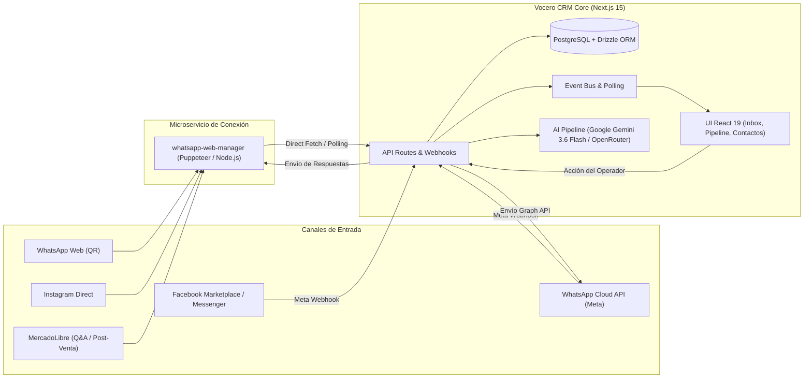

# Vocero CRM Multicanal — Guía Maestra de Proyecto y Arquitectura

Documento técnico y de gestión para guiar al equipo de desarrollo, DevOps y producto.

La autoridad de producto es la [constitución v2.0.0](.specify/memory/constitution.md)
(fork omnicanal de Vocero). Esta guía describe la arquitectura viva; si choca
con la constitución, gana la constitución. La guía de agentes es [`CLAUDE.md`](CLAUDE.md).

---

## 1. Resumen Ejecutivo y Objetivos

### ¿Qué es Vocero CRM?
**Vocero CRM** es una plataforma de **atención al cliente, ventas y CRM omnicanal con Inteligencia Artificial** diseñada para centralizar conversaciones de múltiples canales de mensajería (WhatsApp Web vía QR, WhatsApp Cloud API oficial de Meta, Instagram Direct, MercadoLibre Preguntas/Post-venta y Facebook Messenger) en una única bandeja de entrada multi-agente con pipeline de ventas y soporte de agentes autónomos de IA.



---

## 2. Metas del Negocio

1. **Unificación de Canales:** Centralizar la atención de múltiples vendedores y números de teléfono en una sola plataforma web multi-agente.
2. **Independencia de la API de Meta:** Permitir operar tanto con cuentas de WhatsApp normales vinculadas por código QR (sin costos por plantilla ni restricciones de 24 horas) como con la API oficial de Meta para líneas corporativas masivas.
3. **Automatización con Inteligencia Artificial:** Responder consultas frecuentes de inventario, precios y calificar prospectos automáticamente mediante modelos de lenguaje (Google Gemini 3.6 Flash / OpenRouter) antes de transferir a un asesor humano (*Handoff*).
4. **Seguimiento del Embudo (Pipeline):** Todo contacto que escribe genera automáticamente un *Lead* en el tablero Kanban para medir conversión, clientes perdidos y ventas cerradas.

---

## 3. Estado Actual y Diagnóstico Técnico

### Lo que ya está funcionando y probado:
- ✅ **Bandeja de Entrada Multi-canal (`/inbox`):** Renderiza conversaciones, contactos, estados de lectura, etiquetas de etapa e historial de mensajes completos.
- ✅ **Envío de Mensajes Salientes:** Tanto texto como medios multimedia salen correctamente desde la bandeja hacia WhatsApp Web y son entregados al cliente con confirmación (doble check).
- ✅ **Desbloqueo de Ventana de 24h:** La restricción de 24h de Meta no bloquea las líneas conectadas por WhatsApp Web ni canales omnicanal.
- ✅ **Ingesta Masiva y Sincronización de Chats:** Al conectar la sesión o pulsar "Sincronizar", se extraen e insertan automáticamente los contactos y conversaciones históricas con sus números reales (+58...).
- ✅ **Normalización de Identidad:** Coincidencia de contactos por dígitos numéricos puros para unificar mensajes de `+58...`, `58...` y `@c.us` sin duplicados.
- ✅ **Integración Nativa de Google Gemini:** Soporte directo de `GEMINI_API_KEY` con modelo predeterminado `gemini-3.6-flash`.
- ✅ **Auto-refresco de Bandeja:** Polling automático cada 3.5 segundos en la interfaz web para mantener hilos sincronizados.

### Desafío Actual: Eventos de Entrada en Tiempo Real (Push vs Polling)
- **Situación:** En despliegues multi-contenedor (Coolify / Docker), los Webhooks HTTP salientes desde el contenedor de WhatsApp Web hacia el contenedor de Next.js se ven afectados por el aislamiento de red de Docker (`localhost` no es compartido entre contenedores).
- **Solución Implementada:** Sincronización directa vía API interna (`GET /api/sessions/:id/chats`) + auto-refresco en frontend.
- **Siguiente Mejora:** Configurar un canal persistente de WebSockets o Worker de background para eventos instantáneos por *push*.

---

## 4. Estructura del Código y Componentes

El proyecto se organiza bajo una arquitectura modular limpia en TypeScript:

```text
VOCERO CRM/
├── src/
│   ├── app/                      # Next.js 15 App Router (Frontend + API Routes)
│   │   ├── (app)/                # Vistas de la aplicación autenticada
│   │   │   ├── inbox/            # Bandeja de entrada en tiempo real
│   │   │   ├── pipeline/         # Tablero Kanban de ventas
│   │   │   ├── contacts/         # Libreta y búsqueda de contactos
│   │   │   ├── agent/            # Configuración del bot / IA
│   │   │   └── settings/         # Ajustes de canales, equipo y marca
│   │   └── api/                  # Endpoints REST y Webhooks
│   │       ├── channels/         # Gestión de líneas, sesiones QR y sync
│   │       ├── conversations/    # CRUD de conversaciones, mensajes y sync
│   │       ├── events/           # Server-Sent Events (SSE) para tiempo real
│   │       └── webhooks/         # Receptores de WhatsApp Web, Meta, MeLi, IG
│   ├── components/               # Componentes UI en React 19 (Tailwind + Radix)
│   │   ├── inbox/                # Composer, Thread, ConversationList, ContactPanel
│   │   ├── pipeline/             # Columnas Kanban, Drag-and-Drop, Leads
│   │   └── channels/             # Modal de escaneo QR y estado de conexión
│   ├── lib/                      # Base de datos y utilidades compartidas
│   │   ├── ai/                   # Conector universal LLM (Gemini 3.6 Flash / OpenRouter)
│   │   ├── db/                   # Esquema Drizzle ORM y cliente PostgreSQL
│   │   └── auth/                 # Autenticación multi-inquilino con BetterAuth
│   └── server/                   # Lógica de negocio del servidor
│       ├── ai/                   # Pipeline de IA (Prompting, OpenRouter, Juez)
│       ├── channels/             # Adaptadores de canales (WhatsApp Web, IG, MeLi)
│       └── inbox/                # Ingesta, envío y reglas de negocio
├── services/
│   └── whatsapp-web-manager/     # Microservicio Node.js autónomo
│       ├── WhatsAppMultiManager.js # Motor WPPConnect / Puppeteer multi-sesión
│       ├── InstagramManager.js    # Motor Instagram Direct (Private API)
│       ├── MercadoLibreManager.js # Conector API oficial MercadoLibre
│       └── server.js             # Servidor Express con endpoints de control y QR
├── Dockerfile                    # Multi-stage build para Next.js Standalone
└── docker-compose.yml            # Orquestación (App + PostgreSQL + Caddy)
```

---

## 5. Stack Tecnológico y Lenguajes

| Capa | Tecnología | Propósito |
| :--- | :--- | :--- |
| **Framework Web** | Next.js 15 (App Router, Node.js 22) | Renderizado híbrido SSR/Cliente y API Routes |
| **Lenguaje** | TypeScript 5.8 | Tipado estricto en todo el flujo de datos |
| **Base de Datos** | PostgreSQL 16 + Drizzle ORM | Persistencia relacional, esquemas y migraciones |
| **UI / Estilos** | Tailwind CSS + Lucide Icons + Radix UI | Interfaz rápida, responsiva y accesible |
| **Autenticación** | Better-Auth | Sesiones seguras multi-organización |
| **Gestor Omnicanal** | Puppeteer + WPPConnect Core | Emulación de WhatsApp Web multi-sesión con almacenamiento `LocalAuth` |
| **Tiempo Real** | Server-Sent Events (SSE) + Auto-Polling | Transmisión y refresco de novedades en la bandeja |
| **IA / LLM** | Google Gemini 3.6 Flash (Nativo) / OpenRouter | Generación de respuestas, extracción de datos y juez |
| **Despliegue** | Docker + Coolify + Caddy | CI/CD automático y proxy HTTPS inverso |

---

## 6. Competencias y Skills Requeridos para el Equipo

Para operar y extender esta base de código, el equipo debe dominar:

1. **Frontend Moderno:** React 19, Hooks avanzados (`useMemo`, `useCallback`, `useRef`), Tailwind CSS y consumo de SSE / Polling.
2. **Backend & Base de Datos:** Next.js Server Components, Drizzle ORM, consultas SQL relacionales complejas y diseño de migraciones.
3. **Automatización Web y Scraping:** Node.js, Puppeteer/Chromium headless, depuración del DOM de WhatsApp Web e inyección de scripts IndexedDB.
4. **Infraestructura y DevOps:** Docker Compose, redes internas de Docker (`bridge` vs `host`), Coolify y variables de entorno seguras.
5. **Prompt Engineering & Agentes IA:** Manejo de llamadas a APIs de LLMs estructuradas (JSON Schema con Gemini / Claude / GPT), control de temperatura y diseño de prompts de ventas con *fallback* a humanos.

---

## 7. Hoja de Ruta (Roadmap) y Próximos Pasos

### Fase 1: Perfeccionar Tiempo Real en WhatsApp Web (Inmediato)
- [x] Sincronización directa desde el CRM al gestor de WhatsApp (`/api/sessions/:id/chats`).
- [x] Normalización de identidades y teléfonos para emparejar chats existentes y nuevos.
- [x] Auto-refresco periódico en `/inbox` (catch-up de respaldo cada 12s; SSE primario).
- [x] **Reconexión automática silenciosa:** backoff exponencial con `LocalAuth` (hasta `WA_RECONNECT_MAX_ATTEMPTS`).
- [ ] **Socket / Long-Polling bidireccional:** canal persistente manager → CRM sin depender solo del webhook HTTP.

### Fase 2: Activación de Canales Restantes
- [ ] **Instagram Direct:** Habilitar el módulo `InstagramManager.js` para recibir DMs y respuestas a historias.
- [ ] **MercadoLibre:** Conectar el Webhook oficial de MercadoLibre para responder preguntas en menos de 2 minutos y mensajes post-venta.
- [ ] **Facebook Messenger:** Vinculación de páginas comerciales de Facebook.

### Fase 3: Potenciar el Agente de Inteligencia Artificial (Gemini 3.6 Flash)
- [x] Soporte nativo de `GEMINI_API_KEY` con modelo predeterminado `gemini-3.6-flash`.
- [ ] **Base de Conocimiento (RAG):** Subida de PDFs y catálogos de productos para que la IA responda con datos exactos de stock y precios.
- [ ] **Cierre de Ventas Automatizado:** Capacidad de la IA de solicitar datos de facturación y generar enlaces de pago de forma autónoma.
